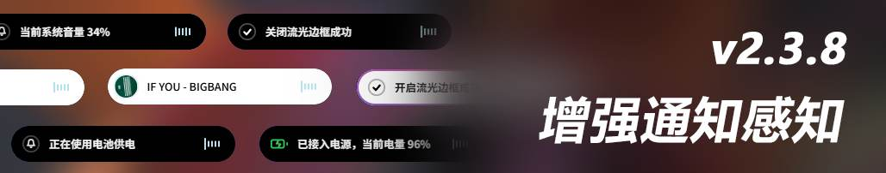
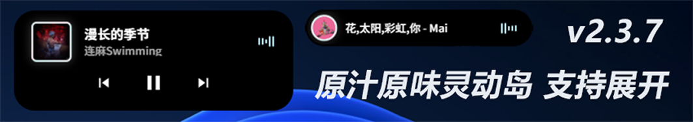

# Music Dynamic Island（MDI）

> **关于本版本**：Music Dynamic Island（简称 **MDI**）由 **鲫鱼 NSD Pro（NetSpeed Dynamic Pro）** 衍生而来。NSD 即 *NetSpeed Dynamic Pro* 的缩写；本分支在项目原版基础上将重心转向“音乐岛”模式，并做了大量音乐相关优化。

<div align="center">


**Music Dynamic Island** —— 专为 Windows 而生的灵动岛

[](https://tauri.app)
[](https://rust-lang.org)
[](https://vuejs.org)
[](https://www.typescriptlang.org)
[](https://vite.dev)
[](https://developer.mozilla.org/docs/Web/API/Canvas_API)
[](https://github.com/lkjhg10576/Music_Dynamic_Island)

</div>





---

这是一个基于 **Tauri 2 + Rust + Vue 3** 的桌面灵动岛组件。灵动岛悬浮窗实时显示网络速度，支持多平台音乐控制、流量统计、系统通知接收、**动态感知**、**实时活动枢纽**（专注番茄钟 / 快捷倒计时 / 硬件监控 / 健康提醒 / 系统动态感知）与硬件监控；支持多实时活动并行、置于任务栏左下角及智能轮换模式。

## 功能

### 网速监控

- **实时网速**：每秒刷新上传/下载速度，自动切换单位
- **灵动岛悬浮窗**：支持拖拽移动、弹簧动画进出场
- **网络状态指示灯**：绿色（正常）/黄色（高延迟）/红色（断网）
- **流量高亮**：超过 1MB/s 时箭头自动高亮提醒
- **速度趋势图表**：控制台内置迷你折线图展示最近 15 秒下载速度
- **本地流量统计**：自动记录每日上传/下载数据，支持柱状图/折线图可视化
- **本月流量统计**：实时计算本月累计使用流量

### 多平台音乐控制

- **播放控制**：上一首 / 播放暂停 / 下一首（通过系统 SMTC API）
- **多平台支持**：网易云音乐、Spotify、Apple Music、QQ音乐、酷狗音乐、Echo Music、洛雪音乐
- **歌曲信息**：实时显示歌名、歌手和专辑封面
- **封面旋转**：播放时封面自动旋转，暂停时停止
- **多源封面获取**：优先从系统 SMTC 提取本地高清封面，降级至网易云、Deezer、Apple Music，SVG 渐变兜底
- **封面缓存**：智能缓存最近 50 首歌曲封面，提升响应速度
- **彩虹流光边框**：8 色渐变旋转边框，可独立开关
- **音频频谱可视化**：实时捕获系统音频输出，通过 FFT 变换生成 5 频段律动频谱，跟随音乐节奏跳动
- **歌名滚动**：长歌名自动水平滚动，展开后切换为双行显示
- **智能交互**：悬停显示控件，离开后自动切换为歌曲信息，1 秒自动收缩
- **弹性按压展开**：点击音乐岛触发弹簧动画展开，显示完整控制按钮
- **音乐进度条**：展开态显示播放进度（已播/总时长/剩余），支持拖动定位（基于 SMTC Timeline）

### 系统消息通知

- **实时捕获**：接收系统 Toast 通知并在灵动岛展示
- **动态扩展**：收到通知时灵动岛自动放大展示应用图标、标题和内容
- **智能过滤**：自动过滤微信通知避免干扰
- **点击唤醒**：点击通知区域直接打开对应应用（基于 aumid 解析来源应用，支持 QQ、微信、钉钉等）
- **静默消息模式**：平时自动隐藏，收到消息后才弹出

### 系统动态感知（sysmsg）

> 由旧版「系统事件监控」重构而来：后端统一为结构化事件，前端以灵动岛 toast 呈现。

- **四类结构化事件**：音量变化 / 电源插拔 / 电量提醒 / 解锁提示。后端统一 `emit('sysmsg-event')`，载荷为 `{ kind, level, text, ts }`（`kind ∈ {volume, power, battery, network, lock, unlock}`）
- **灵动岛 toast 呈现**：事件以通知形式弹出，**不进入实时活动轮换、无长驻图标**，受动态感知总开关管控
- **独立分类开关**：设置页改为竖向功能列表（图标 + 名称 + 描述 + 开关），总闸 = 任一分类开启；分类键未写过时跟随旧 `NSD_SYSMSG_ENABLED`，避免默认全开
- **音量可靠触发与合并续期**：整数百分比比对 + 活跃（300ms）/常态（600ms）/空闲（1200ms）多级轮询 + COM 失败重建；连续调音自动合并续期、长文 ellipsis 兜底
- **锁屏检测**：改用 `winapi` 的 `OpenInputDesktop`/`CloseDesktop`（`GENERIC_READ`），规避 `windows` 0.58 桌面函数在当前特性组合下未导出导致的编译失败
- **网络断连通知**同样受动态感知总开关管控

### 实时活动枢纽（LiveActive）

- **画廊式布局**：横向滚动卡片设计，平滑滚动过渡
- **五大模块**：专注番茄钟 / 快捷倒计时 / 硬件监控 / 健康提醒 / 系统动态感知（打印机队列预留接口）
- **后端化运行**：专注番茄钟、快捷倒计时、健康提醒均由 **Rust 后台线程 + 事件驱动** 实现，关闭前端主窗口（省内存模式）后仍精确计时、到点准时提醒
- **卡片展开**：点击卡片自动展开详情面板，居中显示
- **进度指示器**：滚动边缘渐变遮罩提示可滚动方向
- **模块扩展**：预留系统动态感知、打印机队列等模块接口

### 健康提醒

- **久坐提醒**：可设间隔（默认 1 小时），到点灵动岛弹出“该起来走走了”，并播放系统感叹号音效（Windows `MessageBeep`），支持「跳过一次 / 忽略」
- **喝水提醒**：可设间隔（默认 2 小时），到点灵动岛弹出“该喝水了”，同样带系统音效，支持「跳过一次 / 忽略」
- **实时同步**：灵动岛与 LiveActive 同步各提醒的剩余时间 / 提醒中状态；提醒中每 5 秒重播一次音效

### 多实时活动并行（#23）

- **单常驻小图标**：灵动岛右侧仅保留一个小图标，按 **优先级（priority 升序，平局按固定顺序）** 轮换当前预览的活动
- **参与轮换**：专注番茄钟 / 快捷倒计时 / 硬件监控 / 健康提醒；**音乐岛、网速岛不参与轮换**
- **点击展开**：点击小图标展开当前预览活动详情，并自动推进到下一个候选活动
- **X 回退**：关闭展开态后自动还原到音乐岛或独立小图标态（`clickRtChip` 先统一折叠所有已展开活动，避免多活动并行时状态残留）
- **避让策略**：收到系统 toast（最高优先级）或健康提醒独占态时，小图标自动隐藏，避免遮挡

### 系统硬件监控

- **CPU/内存/GPU**：实时显示占用率
- **高占用预警**：≥90% 时自动红色警示
- **主题自适应**：支持暗色/亮色主题
- **历史曲线**：控制台「实时状态」下拉切换网速 / CPU / 内存，绘制趋势折线图

### 灵动岛轮换模式

- **主岛内容轮换**：在网速岛、音乐岛、硬件监控之间自动轮换主岛显示内容
- **轮换间隔**：每 5 秒自动切换一次显示内容
- **状态互斥**：开启轮换时自动禁用静默消息模式

### 设置与系统集成

- **主题切换**：浅色/深色/跟随系统
- **灵动岛颜色**：支持黑色/白色背景色调切换（CSS rgba 控制，WebView2 透明叠加）
- **透明度调节**：0%~100% 实时同步至悬浮窗
- **开机自启**：跟随系统启动，静默启动时主窗口隐藏
- **系统托盘**：左键唤起控制台，右键强制退出
- **置于任务栏**：锁定至屏幕左下角，禁止拖拽，自动置顶
- **位置锁定**：右键菜单可锁定/解锁灵动岛位置（控制台按钮已移除，统一由右键菜单操作）
- **全屏自动隐藏**：游戏/视频全屏时自动隐藏灵动岛，退出全屏后自动恢复
- **全屏游戏避让**：自动检测全屏窗口，避免抢占焦点
- **检查更新**：静默检测新版本并提示下载，支持 10 秒超时保护
- **实时活动面板**：LiveActive 画廊式设置界面，统一管理五大功能模块与优先级
- **省内存模式**：开启后关闭主窗口彻底销毁 WebView 释放内存（约 50–120MB），托盘点击时重建窗口

## 技术栈

| 层级 | 技术 |
|------|------|
| 桌面框架 | Tauri 2 (Rust) |
| 前端框架 | Vue 3 + TypeScript |
| 构建工具 | Vite 6 |
| 路由 | Vue Router 5 |
| 图表 | 原生 Canvas 2D API |
| 图标 | Lucide Vue Next |
| 网络监控 | sysinfo (Rust) |
| 异步运行时 | Tokio (Rust) |
| HTTP 客户端 | reqwest (Rust) |
| 媒体控制 | Windows SMTC API |
| 音频捕获 | cpal (Rust) |
| 频谱分析 | rustfft (Rust) |
| 动态感知 | Windows COM API + winapi（锁屏检测） |
| Windows API | windows-sys + winapi |
| 本地存储 | localStorage |

## 项目结构

```
Music_Dynamic_Island/
├── src/                          # 前端源码（Vue 3 + TypeScript）
│   ├── main.ts                   # 应用入口
│   ├── App.vue                   # 根组件
│   ├── style.css                 # 全局样式
│   ├── vite-env.d.ts             # Vite 类型声明
│   ├── router/
│   │   └── index.ts              # 路由配置（主窗口单页）
│   ├── views/
│   │   ├── MainPanel.vue         # 主控制台（设置、统计、音乐平台切换、实时状态）
│   │   ├── WidgetIsland.vue      # 灵动岛悬浮窗（网速、音乐、消息、硬件、频谱、进度条、多活动并行）
│   │   └── LiveActive.vue        # 实时活动枢纽（画廊式控制面板，五大模块管理）
│   ├── components/
│   │   ├── SpeedChart.vue        # 原生 Canvas 2D 网速 / CPU / 内存趋势图
│   │   └── StatsChart.vue        # 本地流量统计图表（Canvas 2D）
│   ├── constants/
│   │   └── storageKeys.ts        # localStorage 键名统一管理
│   ├── utils/
│   │   └── format.ts             # 单位 / 时间等格式化工具
│   └── assets/                   # 静态资源（图标、截图、捐赠码）
├── src-tauri/                    # Tauri 后端（Rust）
│   ├── src/
│   │   ├── main.rs               # Rust 入口
│   │   ├── lib.rs                # 核心逻辑、Tauri 命令注册、省内存模式
│   │   ├── audio_spectrum.rs     # 音频频谱分析（FFT）
│   │   ├── music_controller.rs   # 音乐控制器（SMTC API、进度条定位）
│   │   ├── notification.rs       # 系统通知捕获与点击启动来源应用
│   │   ├── system_events.rs      # 系统动态感知（音量/电源/电量/解锁/网络，结构化 sysmsg-event）
│   │   ├── pomodoro.rs           # 专注番茄钟后端（原子状态 + 后台线程 + 事件驱动）
│   │   ├── countdown.rs          # 通用倒计时后端（后台线程 + 提示音 / 事件广播）
│   │   └── health_reminder.rs    # 健康提醒后端（久坐 / 喝水，系统音效 + 事件驱动）
│   ├── capabilities/             # Tauri 权限配置
│   ├── icons/                    # 应用图标
│   ├── Cargo.toml                # Rust 依赖
│   ├── build.rs                  # 构建脚本
│   └── tauri.conf.json           # Tauri 配置
├── public/                       # 静态公共资源
├── index.html                    # HTML 模板
├── vite.config.ts                # Vite 配置
├── tsconfig.json                 # TypeScript 配置
├── package.json                  # 前端依赖与脚本
```

## 开发环境

### 前置依赖

- Node.js >= 18
- Rust >= 1.70
- Tauri 2 CLI
- 当前版本：`0.4.0-2`（测试版）

### 安装与运行

```bash
git clone https://github.com/lkjhg10576/Music_Dynamic_Island.git
cd Music_Dynamic_Island
npm install
npm run tauri dev
```

### 构建发布

```bash
npm run tauri build
```

产物位于 `src-tauri/target/release/bundle/`。

## 使用方式

1. 启动后显示主控制台，点击系统托盘可随时唤起
2. 开启 Widget 开关，屏幕顶部出现灵动岛悬浮窗
3. 左键拖拽移动，右键菜单可重置位置、锁定位置、开关流光边框或关闭（位置解锁统一在右键菜单中操作）
4. 在“灵动岛设置”中选择音乐平台、开启音乐控制、消息通知、硬件监控或轮换模式
5. 在“灵动岛设置”中切换灵动岛颜色（亮色/暗色）和开启静默消息模式
6. 控制台右侧可切换常规设置与数据统计面板，支持柱状图/折线图切换
7. 点击“LiveActive 设置”进入实时活动枢纽，配置五大模块（专注番茄钟 / 快捷倒计时 / 硬件监控 / 健康提醒 / 系统动态感知）与优先级
8. 在“系统动态感知”设置中为音量 / 电源 / 电量 / 解锁分类逐项开关（总闸 = 任一分类开启）
9. 开启健康提醒后，到点灵动岛弹出久坐 / 喝水提示并播放系统音效；多实时活动并行时右侧小图标按优先级轮换，点击展开、X 回退
10. 开启“全屏自动隐藏”，游戏/视频全屏时自动隐藏灵动岛

## 开源协议

Apache License 2.0

Copyright (c) 2026 lkjhg10576

本项目（Music Dynamic Island / MDI）基于 **NetSpeed Dynamic Pro（鲫鱼 NSD Pro）** 衍生开发：原项目由 Ryen (GEORGEWU) 以 MIT 协议开源，其 MIT 许可正文已保留在 [LICENSE.md](./LICENSE.md) 前部；本衍生版本（含全部新增与修改）采用 Apache License 2.0 重新授权，版权归 lkjhg10576 所有。完整许可证文本见 [LICENSE.md](./LICENSE.md)。

## 捐赠

如果 MDI 对你有帮助，欢迎请作者喝杯咖啡！

| 方式 | 信息 |
|------|------|
| 微信支付 | [微信](./src/assets/wechat-pay.png) |
| 支付宝 | [支付宝](./src/assets/alipay.jpg) |
| GitHub Sponsors | [前往支持](https://github.com/sponsors/lkjhg10576) |

---

> 感谢每一位支持者！
